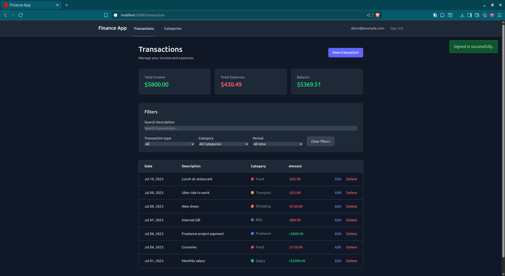
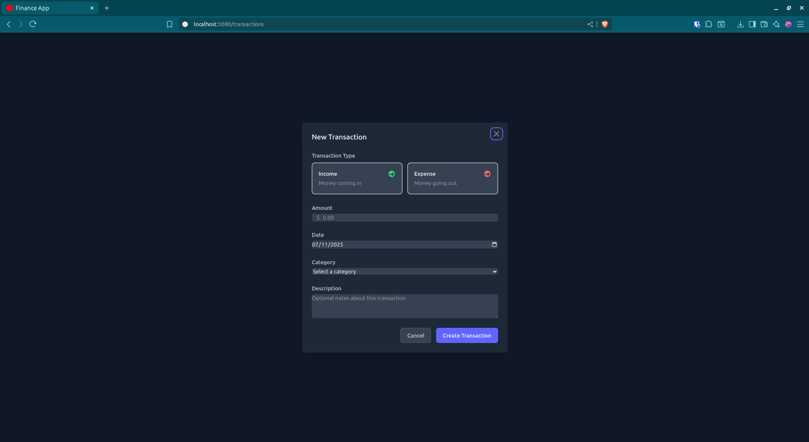
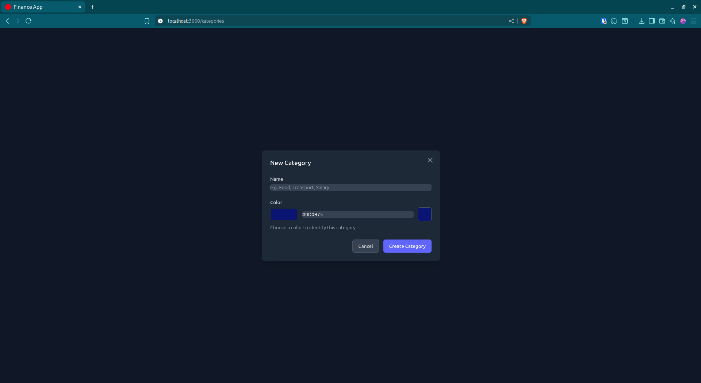
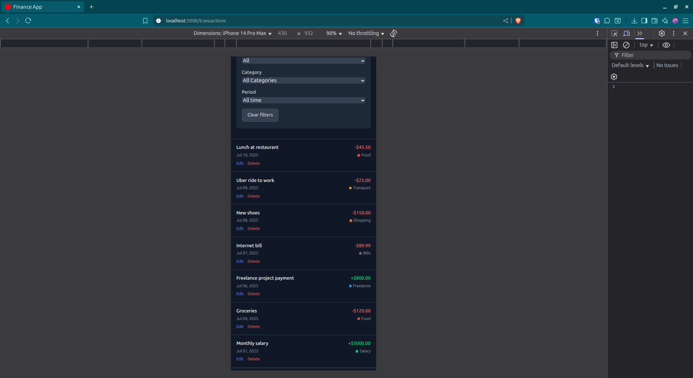

# Finance App

A modern personal finance management application built with Ruby on Rails 8, following 37signals patterns and conventions.

## Screenshots & Demo

### Dashboard Overview

*Main dashboard showing balance summary and recent transactions*

### Transaction Management

*Creating and editing transactions with real-time updates*

### Category Management

*Custom categories with color coding*

### Mobile Experience

*Responsive design optimized for mobile devices*

### Live Demo
[🎥 **Watch Demo Video**](https://drive.google.com/file/d/1AkaJr_SvZqhYPfp5agA1tad0IEmuOhR8/view?usp=sharing)

*Live demonstration of key features and Turbo interactions*

## Features

- **Transaction Management**: Create, edit, and delete income/expense transactions
- **Category Organization**: Organize transactions with custom categories and colors
- **Real-time Updates**: Instant UI updates using Turbo Frames and Turbo Streams
- **Dark Mode**: Toggle between light and dark themes
- **Responsive Design**: Mobile-first design with TailwindCSS
- **Dashboard**: Overview of balance, income, and expenses
- **User Authentication**: Secure user registration and login with Devise

## Tech Stack

- **Backend**: Ruby on Rails 8.0.2
- **Database**: PostgreSQL
- **Frontend**: Hotwire (Turbo + Stimulus), TailwindCSS
- **Authentication**: Devise
- **Testing**: RSpec, Factory Bot, Capybara
- **Deployment**: Kamal with Docker
- **Code Quality**: RuboCop, Brakeman

## Getting Started

### Prerequisites

- Ruby 3.3+
- PostgreSQL 15+
- Node.js 18+
- Docker & Docker Compose (for containerized development)

### Local Development (without Docker)

1. **Install dependencies:**
   ```bash
   bundle install
   ```

2. **Setup database:**
   ```bash
   rails db:create
   rails db:migrate
   rails db:seed
   ```

3. **Start the server:**
   ```bash
   ./bin/dev
   ```

4. **Visit the application:**
   - Open http://localhost:3000

### Docker Development (Recommended)

1. **Start the application:**
   ```bash
   docker compose up
   ```

2. **Setup database (first time only):**
   ```bash
   docker compose exec web rails db:create
   docker compose exec web rails db:migrate
   docker compose exec web rails db:seed
   ```

3. **Visit the application:**
   - Rails app: http://localhost:3000
   - PostgreSQL: localhost:5433

For detailed Docker instructions, see [README.docker.md](README.docker.md).

## Available Commands

### Development
```bash
# Local development
./bin/dev                    # Start with hot reload
rails console               # Rails console
rails db:migrate            # Run migrations
rails db:seed               # Seed database

# Docker development
docker compose up           # Start all services
docker compose exec web rails console
docker compose exec web rails db:migrate
docker compose exec web rails db:seed
```

### Testing
```bash
# Local
bundle exec rspec           # Run all tests
bundle exec rspec spec/models    # Run model tests
bundle exec rubocop         # Code linting

# Docker
docker compose exec web rspec
docker compose exec web rubocop
```

### Deployment
```bash
kamal setup                 # Initial setup
kamal deploy               # Deploy to production
```

## Project Structure

```
app/
├── controllers/
│   ├── concerns/           # Authentication, shared logic
│   ├── categories_controller.rb
│   ├── transactions_controller.rb
│   └── home_controller.rb
├── models/
│   ├── user.rb            # Devise user with balance calculations
│   ├── category.rb        # Transaction categories
│   └── transaction.rb     # Income/expense transactions
├── views/
│   ├── categories/        # Category CRUD with Turbo
│   ├── transactions/      # Transaction CRUD with Turbo
│   ├── home/             # Dashboard
│   └── shared/           # Reusable partials
└── javascript/
    └── controllers/       # Stimulus controllers
```

## Key Features in Detail

### Transaction Management
- Create income and expense transactions
- Categorize with custom categories
- Real-time balance updates
- Mobile-responsive forms

### Categories
- Custom categories with color coding
- Used to organize transactions
- Cannot be deleted if transactions exist

### Real-time UI
- Turbo Frames for instant updates
- Turbo Streams for live balance updates
- No page reloads for CRUD operations

### Authentication
- Secure user registration/login
- User-scoped data (users only see their own data)
- Session management with Devise

## Database Schema

### Users
- Authentication via Devise
- Has many categories and transactions
- Balance calculation methods

### Categories
- Belongs to user
- Has name and color
- Has many transactions

### Transactions
- Belongs to user and category
- Amount, date, description
- Type: income or expense

## Testing

The application includes comprehensive tests:

```bash
# Run all tests
bundle exec rspec

# Run specific test types
bundle exec rspec spec/models
bundle exec rspec spec/controllers
bundle exec rspec spec/system
```

Test coverage includes:
- Model validations and methods
- Controller actions and responses
- System tests for user workflows

## Deployment

The application is configured for deployment using Kamal:

1. **Setup environment:**
   ```bash
   cp .env.example .env
   # Edit .env with your values
   ```

2. **Deploy:**
   ```bash
   kamal setup    # First time
   kamal deploy   # Subsequent deploys
   ```

## Contributing

1. Follow the Rails conventions outlined in `CLAUDE.md`
2. Write tests for new features
3. Run the test suite and linting before submitting
4. Use meaningful commit messages

## Development Guidelines

- Follow 37signals patterns and conventions
- Use Turbo for real-time updates
- Write tests for all new features
- Maintain code quality with RuboCop
- Keep controllers thin, models fat
- Use Stimulus for JavaScript interactions

## Security

- Regular security audits with Brakeman
- Secure authentication with Devise
- CSRF protection enabled
- SQL injection prevention with Active Record

## License

This project is available as open source under the terms of the MIT License.